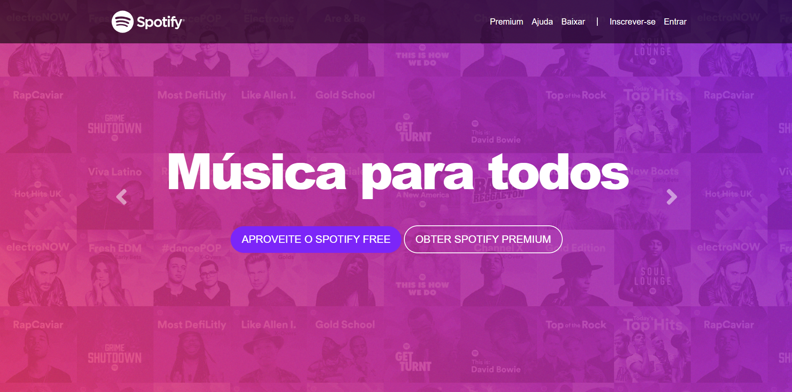
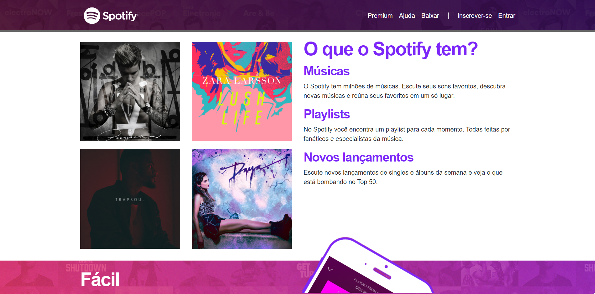
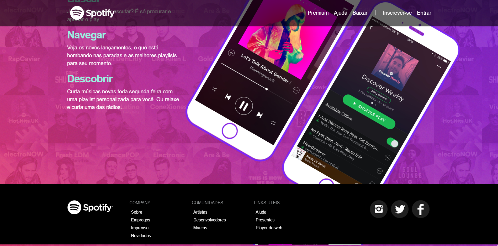

# Spotify

A project developed during a course on udemy that can be found [here](https://www.udemy.com/course/web-completo/)
 
The page is entirely responsive

# Used Technologies

> - CSS
> - HTML

# Used Frameworks

>- Bootstrap

# Previews

